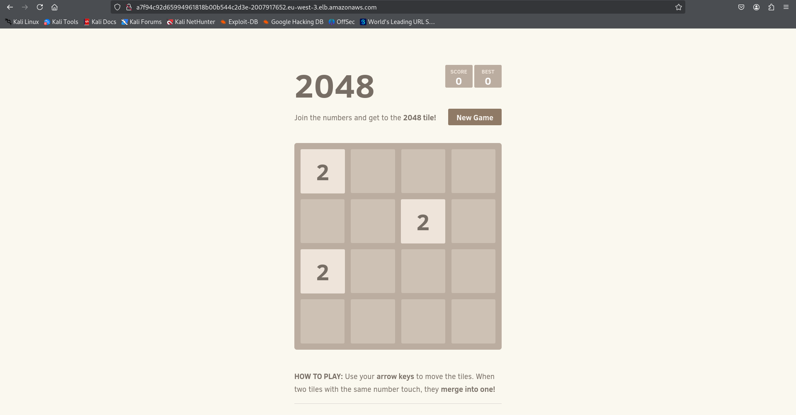

# Projet Kubernetes de A à Z sur EKS (Amazon Kubernetes Service)


## **Prérequis**

**kubectl** – Un outil en ligne de commande pour travailler avec des clusters Kubernetes. Pour plus d’informations, voir Installer ou mettre à jour kubectl.

**eksctl** – Un outil en ligne de commande pour gérer les clusters EKS qui automatise de nombreuses tâches. Pour plus d’informations, voir Installer ou mettre à jour eksctl.

**AWS CLI** – Un outil en ligne de commande pour travailler avec les services AWS, y compris Amazon EKS. Pour plus d’informations, voir Installer, mettre à jour et désinstaller AWS CLI dans le Guide de l’interface en ligne de commande AWS. Après l’installation, il est recommandé de configurer AWS CLI avec `aws configure`.

## ✅ Titre du projet : Déploiement du jeu 2048 sur Amazon EKS

## ✅ Description du projet

***Un projet Kubernetes de bout en bout (End-to-End) pour déployer une application jeu 2048 sur Amazon Elastic Kubernetes Service (EKS). Ce projet consiste à configurer, déployer et gérer l’application populaire 2048 sur un cluster Kubernetes tournant sur AWS EKS. L’objectif est de montrer comment containeriser une application web, la déployer sur EKS, gérer le cluster et exposer l’application aux utilisateurs.***


### Étape 1 : Créer un cluster EKS via terraform/ role IAM / group node


```hcl
terraform plan
terraform apply
#Le processus prendra 10-15 minutes.
```
### Étape 2 : Créer un rôle IAM **eks-cluster-role** avec 1 politique attachée : AmazonEKSClusterPolicy

```
Créer un autre rôle IAM 'eks-node-grp-role' avec 3 politiques attachées : 
(Permet aux instances EC2 d’appeler les services AWS en votre nom.)
    - AmazonEKSWorkerNodePolicy
    - AmazonEC2ContainerRegistryReadOnly
    - AmazonEKS_CNI_Policy
```

```
Choisir le VPC par défaut, choisir 2 ou 3 sous-réseaux (subnets)
Choisir un groupe de sécurité qui ouvre les ports 22, 80, 8080
Accès au point de terminaison du cluster : public

# Pour VPC CNI, CoreDNS et kube-proxy, choisir les versions par défaut, pour CNI, la version "latest" est différente de "default". Prendre "default".

Cliquer sur 'Create'. Le processus prendra 10-12 minutes. Attendre que le cluster soit actif.
```

### Étape 3 : Ajouter des groupes de nœuds au cluster


```
Maintenant, ajoutons les nœuds worker où les pods vont tourner

Ouvrir le cluster > Compute > Add Node Group
Nom : <votre_nom>-eks-nodegrp-1
Sélectionner le rôle IAM créé précédemment
Laisser les autres valeurs par défaut

AMI - choisir la première AMI par défaut (Amazon Linux 2)
Changer desired/minimum/maximum à 1 (au lieu de 2)
Activer l’accès SSH. Choisir un groupe de sécurité qui autorise les ports 22, 80, 8080

Laisser les autres champs avec leurs valeurs par défaut

La création du groupe de nœuds peut prendre 2-3 minutes
```

### Étape 4 : Authentification au cluster

```
Référence :
https://docs.aws.amazon.com/eks/latest/userguide/create-kubeconfig.html

Ouvrir CloudShell ou via SSH

# Tapez dans la CLI AWS
aws sts get-caller-identity
# Observez les détails du compte et de l’utilisateur

# Créer un fichier kubeconfig qui stocke les identifiants pour EKS :
# kubeconfig permet de se connecter au cluster avec kubectl.
aws eks update-kubeconfig --region code-region --name nom-du-cluster
ex : aws eks update-kubeconfig --region eu-west-3 --name mon-cluster-eks

# Vérifier que les nœuds sont disponibles
kubectl get nodes

# Installer l’éditeur nano dans CloudShell, utile pour la suite
sudo yum install nano -y
```

### Étape 5 : Créer un deployment pour le jeu 2048

```yaml
apiVersion: apps/v1
kind: Deployment
metadata:
  name: game-2048
  labels:
    app: game-2048
spec:
  replicas: 1
  selector:
    matchLabels:
      app: game-2048
  template:
    metadata:
      labels:
        app: game-2048
    spec:
      containers:
      - name: game-2048
        image: blackicebird/2048
        ports:
        - containerPort: 80
```

```
# Appliquer le fichier pour créer le pod
kubectl apply -f 2048-deployment.yaml
# deployment.apps/game-2048 created

# Voir le pod créé
kubectl get pods
```

### Étape 6 : Configurer un service LoadBalancer

```yaml
apiVersion: v1
kind: Service
metadata:
  name: game-2048-svc
spec:
  selector:
    app: game-2048
  ports:
  - protocol: TCP
    port: 80
    targetPort: 80
  type: LoadBalancer
```

```
# Appliquer la configuration service
kubectl apply -f 2048-svc.yaml
```

```
# Voir les détails du service
kubectl describe svc game-2048-svc
```


```
# Accéder à l’ingress LoadBalancer
curl <EXTERNAL-IP>:80
```



